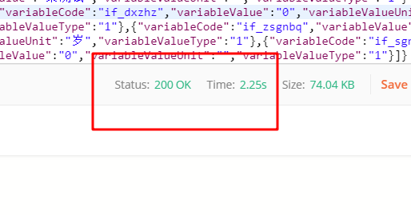

# Java中的锁分类

在读很多并发文章中，会提及各种各样锁如公平锁，乐观锁等等，这篇文章介绍各种锁的分类。介绍的内容如下：

- 公平锁/非公平锁
- 可重入锁
- 独享锁/共享锁
- 互斥锁/读写锁
- 乐观锁/悲观锁
- 分段锁
- 偏向锁/轻量级锁/重量级锁
- 自旋锁

上面是很多锁的名词，这些分类并不是全是指锁的状态，有的指锁的特性，有的指锁的设计，下面总结的内容是对每个锁的名词进行一定的解释。

**公平锁/非公平锁**

公平锁是指多个线程按照申请锁的顺序来获取锁。
非公平锁是指多个线程获取锁的顺序并不是按照申请锁的顺序，有可能后申请的线程比先申请的线程优先获取锁。有可能，会造成优先级反转或者饥饿现象。
对于Java `ReentrantLock`而言，通过构造函数指定该锁是否是公平锁，**默认是非公平锁。非公平锁的优点在于吞吐量比公平锁大**。
对于`Synchronized`而言，**也是一种非公平锁**。由于其并不像`ReentrantLock`是通过AQS的来实现线程调度，所以并没有任何办法使其变成公平锁。

**可重入锁**

可重入锁又名递归锁，是指在同一个线程在外层方法获取锁的时候，在进入内层方法会自动获取锁。说的有点抽象，下面会有一个代码的示例。
对于Java `ReentrantLock`而言, 他的名字就可以看出是一个可重入锁，其名字是`Re entrant Lock`重新进入锁。
对于`Synchronized`而言,也是一个可重入锁。可重入锁的一个好处是可一定程度避免死锁。

```java
synchronized void setA() throws Exception{
	Thread.sleep(1000);
	setB();
}

synchronized void setB() throws Exception{
	Thread.sleep(1000);
}
```

上面的代码就是一个可重入锁的一个特点，如果不是可重入锁的话，setB可能不会被当前线程执行，可能造成死锁。

**独享锁/共享锁**

独享锁是指该锁一次只能被一个线程所持有。
共享锁是指该锁可被多个线程所持有。

对于Java `ReentrantLock`而言，其是独享锁。但是对于Lock的另一个实现类`ReadWriteLock`，其读锁是共享锁，其写锁是独享锁。
读锁的共享锁可保证并发读是非常高效的，读写，写读 ，写写的过程是互斥的。
独享锁与共享锁也是通过AQS来实现的，通过实现不同的方法，来实现独享或者共享。
对于`Synchronized`而言，当然是独享锁。

**互斥锁/读写锁**

上面讲的独享锁/共享锁就是一种广义的说法，互斥锁/读写锁就是具体的实现。
互斥锁在Java中的具体实现就是`ReentrantLock`
读写锁在Java中的具体实现就是`ReadWriteLock`

**乐观锁/悲观锁**

**乐观锁与悲观锁不是指具体的什么类型的锁，而是指看待并发同步的角度**。
悲观锁认为对于同一个数据的并发操作，一定是会发生修改的，哪怕没有修改，也会认为修改。因此对于同一个数据的并发操作，悲观锁采取加锁的形式。悲观的认为，不加锁的并发操作一定会出问题。 

乐观锁则认为对于同一个数据的并发操作，是不会发生修改的。在更新数据的时候，会采用尝试更新，不断重试的方式更新数据。乐观的认为，不加锁的并发操作是没有事情的。

从上面的描述我们可以看出，悲观锁适合写操作非常多的场景，乐观锁适合读操作非常多的场景，不加锁会带来大量的性能提升。
悲观锁在Java中的使用，就是利用各种锁。
乐观锁在Java中的使用，是无锁编程，常常采用的是CAS算法，典型的例子就是原子类，通过CAS自旋实现原子操作的更新。

**分段锁**

**分段锁其实是一种锁的设计，并不是具体的一种锁**，对于`ConcurrentHashMap`而言，其并发的实现就是通过分段锁的形式来实现高效的并发操作。
我们以`ConcurrentHashMap`来说一下分段锁的含义以及设计思想，`ConcurrentHashMap`中的分段锁称为Segment，它即类似于HashMap（JDK7与JDK8中HashMap的实现）的结构，即内部拥有一个Entry数组，数组中的每个元素又是一个链表；同时又是一个ReentrantLock（Segment继承了ReentrantLock)。
当需要put元素的时候，并不是对整个hashmap进行加锁，而是先通过hashcode来知道他要放在那一个分段中，然后对这个分段进行加锁，所以当多线程put的时候，只要不是放在一个分段中，就实现了真正的并行的插入。
但是，在统计size的时候，可就是获取hashmap全局信息的时候，就需要获取所有的分段锁才能统计。
**分段锁的设计目的是细化锁的粒度**，当操作不需要更新整个数组的时候，就仅仅针对数组中的一项进行加锁操作。

**偏向锁/轻量级锁/重量级锁**

**这三种锁是指锁的状态**，并且是针对`Synchronized`。在Java 5通过引入锁升级的机制来实现高效`Synchronized`。这三种锁的状态是通过对象监视器在对象头中的字段来表明的。
偏向锁是指一段同步代码一直被一个线程所访问，那么该线程会自动获取锁。降低获取锁的代价。
轻量级锁是指当锁是偏向锁的时候，被另一个线程所访问，偏向锁就会升级为轻量级锁，其他线程会通过自旋的形式尝试获取锁，不会阻塞，提高性能。
重量级锁是指当锁为轻量级锁的时候，另一个线程虽然是自旋，但自旋不会一直持续下去，当自旋一定次数的时候，还没有获取到锁，就会进入阻塞，该锁膨胀为重量级锁。重量级锁会让其他申请的线程进入阻塞，性能降低。

**自旋锁**

在Java中，自旋锁是指尝试获取锁的线程不会立即阻塞，而是采用循环的方式去尝试获取锁，这样的好处是减少线程上下文切换的消耗，缺点是循环会消耗CPU。
典型的自旋锁实现的例子，可以参考[自旋锁的实现](http://ifeve.com/java_lock_see1/)


# 乐观锁与悲观锁

乐观锁总是假设最好的情况，每次去拿数据的时候都认为别人不会修改，所以不会上锁，但是在更新的时候会判断一下在此期间别人有没有去更新这个数据。**乐观锁适用于多读的应用类型**，因为乐观锁在读取数据的时候不会去加锁，这样可以省去了锁的开销，加大了系统的整个吞吐量。 像数据库提供的类似于**write_condition机制**，其实都是提供的乐观锁。在Java中`java.util.concurrent.atomic`包下面的原子变量类就是使用了乐观锁的一种实现方式**CAS**实现的。 即使偶尔有冲突，这也无伤大雅，要么重新尝试提交要么返回给用户说跟新失败，当然，`前提是偶尔发生冲突`，但如果经常产生冲突，上层应用会不断的进行自旋重试，这样反倒是降低了性能，得不偿失。


悲观锁总是假设事情向着坏的方向发展 。 悲观锁每次去拿数据的时候都认为别人会修改，所以每次在拿数据的时候都会上锁，这样别人想拿这个数据就会阻塞住，直到我释放了锁，别人才能拿到锁，这样的话，数据只有本身一个线程在修改，就确保了数据的准确性。因此，**悲观锁适用于写多的应用类型** 

## 乐观锁常用实现方式

### 版本号机制

版本号机制就是在表中增加一个字段，`version`，在修改记录的时候，先查询出记录，再每次修改的时候给这个字段值加1，判断条件就是你刚才查询出来的值。看下面流程就明白了：

 


### CAS

CAS即 compare and swap（比较与交换），是一种著名的无锁算法。无锁编程，即不使用锁（没有线程被阻塞）的情况下实现多线程之间的变量同步，所以也叫非阻塞同步（Non-blocking Synchronization）。**CAS 算法涉及到三个操作数**：

1. 需要读写的内存值 V(**主内存**中的变量值)
2. 进行比较的值 A(**克隆下来线程本地内存中的变量值**)
3. 拟写入的新值 B(要更新的新值)

**当且仅当 V 的值等于 A 时，CAS 通过原子方式用新值 B 来更新 V 的值，否则不会执行任何操作**（比较和替换是一个 native 原子操作）。一般情况下，这是一个自旋操作，即不断的重试，看下面流程：

 


  CAS算法模拟数据库更新数据(表还是刚才那个表,用户张三的金额初始值为1000),给用户张三的金额增加100： 

```java
private void updateMoney(String userName){
     // 死循环
     for (;;){
         // 获取张三的金额
         BigDecimal money = this.userMapper.getMoneyByName(userName);
         User user = new User();
         user.setMoney(money);
         user.setUserName(userName);
         // 根据用户名和金额进行更新(金额+100)
         Integer updateCount = this.userMapper.updateMoneyByNameAndMoney(user);
         if (updateCount != null && updateCount.equals(1)){
             // 如果更新成功就跳出循环
             break;
         }
     }
 }
```

 看到这里，明眼人都发现了一些CAS更新的问题--ABA问题 

 注意，这里的加版本号机制和CAS出现ABA问题加版本号解决机制不是同一个。 

### 乐观锁的缺点

#### ABA 问题


上面在说乐观锁用CAS方式实现的时候有个问题，问题如下： 

 

说明用CAS实现的乐观锁才会有ABA问题 

解决方案：

给表增加一个`version`字段，每修改一次值加1，这样就能在写入的时候判断获取到的值有没有被修改过，流程图如下：

 

#### 循环时间长开销大

自旋CAS（也就是不成功就一直循环执行直到成功）如果长时间不成功，会给CPU带来非常大的执行开销。个人想法是在死循环添加尝试次数，达到尝试次数还没成功的话就返回失败。不确定有没有什么问题，欢迎指出。 

#### 只能保证一个共享变量的原子操作

CAS 只对单个共享变量有效，当操作涉及跨多个共享变量时 CAS 无效。**但是从 JDK 1.5开始，提供了AtomicReference类来保证引用对象之间的原子性，你可以把多个变量放在一个对象里来进行 CAS 操作。所以我们可以使用锁或者利用AtomicReference类把多个共享变量合并成一个共享变量来操作**。


## 悲观锁常用实现方式

### ReentrantLock

可重入锁就是悲观锁的一种，如果你看过前两篇文章，对可重入锁的原理就很清楚了，不清楚的话就看下如下的流程： 

 假设同步状态值为0表示未加锁，为1加锁成功

 


可以看到，只要线程A获取了锁，还没释放的话，线程B是无法获取锁的，除非A释放了锁，B才能获取到锁，加锁的方式都是通过CAS去比较再交换，B会尝试自旋去设值，在尝试几次之后，就会阻塞线程，等到前驱节点出队通知之后再次尝试获取锁，这也就说明了为啥悲观锁比起乐观锁来说更加消耗性能。


### synchronized

 其实和上面差不多的，只不过上面自身维护了一个volatile int类型的变量，用来描述获取锁与释放锁，而synchronized是靠指令判断加锁与释放锁的，如下代码： 

```java
public class synchronizedTest { 
	......
    public void synchronizedTest(){
        synchronized (this){
            mapper.updateMoneyByName("张三");
        }
    }
}
```

 上面代码对应的流程图如下： 

 

 如果在某个线程执行synchronizedTest()方法的过程中出现了异常，monitorexit指令会插入在异常处，`ReentrantLock`需要你手动去加锁与释放锁，而`synchronized`是JVM来帮你加锁和释放锁。 

### 悲观锁的缺点

#### synchronized

锁的释放情况少，只在程序正常执行完成和抛出异常时释放锁；
试图获得锁是不能设置超时；
不能中断一个正在试图获得锁的线程；
无法知道是否成功获取到锁；

补充： Java并发编程这个领域中synchronized关键字一直都是元老级的角色，很久之前很多人都会称它为 **“重量级锁”** 。但是，在JavaSE 1.6之后进行了主要包括为了减少获得锁和释放锁带来的性能消耗而引入的 **偏向锁** 和 **轻量级锁** 以及其它**各种优化**之后变得在某些情况下并不是那么重了。synchronized的底层实现主要依靠 **Lock-Free** 的队列，基本思路是 **自旋后阻塞**，**竞争切换后继续竞争锁**，**稍微牺牲了公平性，但获得了高吞吐量**。在线程冲突较少的情况下，可以获得和CAS类似的性能；而线程冲突严重的情况下，性能远高于CAS。


### ReentrantLock

不要忘记在finally 模块释放锁, 


# CAS源码分析

 原子类为了解决什么样的问题?

 答: 为了解决并发场景下无锁的方式保证单一变量的数据一致性 

大家应该都知道, 类似于代码中的 i++ 操作, 虽然是一行, 但是执行时候是分为三步的

- 从主存获取变量 i
- 变量i值+1
- 新增后变量i值写回主存

写个程序来更好的理解, 不论我们怎么运行下方程序, 99% 以上概率不会到达 100000000

```java
static int NUM = 0;
public static void main(String[] args) throws InterruptedException {
    for (int i = 0; i < 10000; i++) {
        new Thread(() -> {
            for (int j = 0; j < 10000; j++) {
                NUM++;
            }
        }).start();
    }
    Thread.sleep(2000);
    System.out.println(NUM);
} 
```

结果: 

 

 可以使用 JDK 自带的 synchronized, 通过 **互斥锁的方式** 同步执行 NUM++ 这个代码块 

```java
  static int NUM = 0;
    public static void main(String[] args) throws InterruptedException {
        for (int i = 0; i < 10000; i++) {
            new Thread(() -> {
                for (int j = 0; j < 10000; j++) {
                    synchronized (Object.class) {
                        NUM++;
                    }
                }
            }).start();
        }
        Thread.sleep(2000);
        System.out.println(NUM);
    }
```

 

 如果看过 JDK 源码 JUC 包下的类库源代码, 关于 **Atomic 开头的类库** 应该不会陌生 

 如果不使用锁来解决上面的非原子自增问题, 可以这么来写 

```java
   static AtomicInteger NUM = new AtomicInteger();
    public static void main(String[] args) throws InterruptedException {
        for (int i = 0; i < 10000; i++) {
            new Thread(() -> {
                for (int j = 0; j < 10000; j++) {
                    // 重点, 自增并获取新值
                    NUM.incrementAndGet();
                }
            }).start();
        }
        Thread.sleep(2000);
        System.out.println(NUM);
    }
```

## AtomicInteger 简介

AtomicInteger 是 JDK 并发包下提供的 **操作Integer类型原子类**, 通过调用底层  **Unsafe 的 CAS 相关方法实现原子操作** 

**基于乐观锁的思想**实现的一种无锁化原子操作, **保障了多线程情况下单一变量的线程安全问题** 

### 优点:  

AtmoicInteger 使用硬件级别的指令 CAS 来更新计数器的值, 机器直接支持的指令, **这样可以避免加锁**

比如像互斥锁 synchronized 在并发比较严重情况下, 会将锁 **升级到重量级锁**

唤醒与阻塞线程时会有一个 **用户态到内核态的一个转变, 而转换状态是需要消耗很多时间的**

写过程序进行测试, 尽管 synchronized 经过升级后, 性能有了大幅度提升, 但在 **一般并发场景下, CAS 无锁算法性能更高一些**  

当然不可能会有尽善尽美的存在, 关于 CAS 无锁算法会在下面说明劣势所在 

### 实现

AtomicInteger 有两个构造方法, 分别是一个无参构造及有参构造

- 无参构造的 value 就是 int 的默认值 0
- 有参构造会将 value 赋值

```java
public AtomicInteger() { }

public AtomicInteger(int initialValue) {
    value = initialValue;
}
```

AtomicInteger 有三个重要的变量, 分别是:

**Unsafe:** 可以理解它对于 Java 而言, 是一个 "BUG" 的存在, 在 AtomicInteger 里的最大作用就是直接操作内存进行值替换 

**value:** 使用 int 类型存储 AtomicInteger 计算的值, 通过 volatile 进行修饰, **提供了内存可见性及防止指令重排序**

**valueOffset:** value 的内存偏移量


 

 这里罗列出一些常用API, 核心实现思路都是一致的, 会着重讲其中一个 

```java
// 获取当前 value 值
public final int get();
// 取当前的值, 并设置新的值
public final int getAndSet(int newValue);
// 获取当前的值, 并加上预期的值
public final int getAndAdd(int delta);
// 获取当前值, 并进行自增1
public final int getAndIncrement();  
// 获取当前值, 并进行自减1
public final int getAndDecrement();
```

**获取当前值并自增 #getAndIncrement()**

看一下具体在源码中是如何操作的

```java
public final int getAndIncrement() {
  	return unsafe.getAndAddInt(this, valueOffset, 1);
}

/**
 * Unsafe.java
 * unsafe.getAndAddInt
 *
 * @param var1 AtomicInteger 对象
 * @param var2 value 内存偏移量
 * @param var4 增加的值, 比如在原有值上 + 1
 * @return
 */
public final int getAndAddInt(Object var1, long var2, int var4) {
    int var5;
    do {
        // 内存中 value 最新值
        var5 = this.getIntVolatile(var1, var2);//这是个native方法
    } while (!this.compareAndSwapInt(var1, var2, var5, var5 + var4));

    return var5;
} 
```

这里就是 CAS 体现无锁算法的地方, 先来说下这段代码的执行步骤

1、根据 AtomicInteger 对象 以及 value 内存偏移量获取对应 value 最新值

2、通过 compareAndSwapInt(...) **将内存中的值(var5)更改为期望的值 (var5+var4)**, 不存在多线程竞争成功修改返回 True 结束循环, Flase 继续执行循环


精髓的地方就在于 **compareAndSwapInt(...)** 

```java
/**
 * 比较 var1 的 var2 内存偏移量处的值是否和 var4 相等, 相等则更新为 var5
 *
 * @param var1 AtomicInteger 对象
 * @param var2 value 内存偏移量
 * @param var4 value 原本的值
 * @param var5 期望将 value 设置的值
 * @return
 */
public final native boolean compareAndSwapInt(Object var1, long var2, int var4, int var5);
```

由于是 **native 关键字**修饰, 我们无法查看其源码, 说明一下方法思路

1、通过 var1(AtomicInteger) 获取到 var2 (内存偏移量) 的 value 值 

2、将 第一步获取到的value(内存中值) 与 var4(**线程内获取的value值**  查看上面代码，是通过`this.getIntVolatile(var1, var2)`拿到的) 进行比较

3、如果相等将 var5(期望值) 设置为内存中新的 value 并返回 True

4、不相等返回 False 继续尝试执行循环

 ### 图文分析

**Unsafe#getAndAddInt()** 以此方法为例

这个图片相当于 AtomicInteger 对象对应的 valueOffset 位置

 

 线程1执行 `var5 = this.getIntVolatile(var1, var2) ` 

 

 线程2执行 `var5 = this.getIntVolatile(var1, var2) `

 此时在线程1、2的工作内存中 var5 都是 0 

 

 线程1欲修改内存中的 value 为1, 通过比对 var4 与内存中的值相等, 内存值成功被设置成 1 

 

 线程2也是要修改内存中对应的 value 值, 发现已经不相等了, 返回 False 继续尝试修改 

 

### 不足之处

 CAS 虽然能够实现无锁编程, 在一般情况下对性能做出了提升, 但是并不是没有局限性或缺点 

 **CPU 自旋开销较大** 

 在高并发情况下, 自旋 CAS 如果长时间不成功, 会给 CPU 带来非常大的执行开销 

 如果是实现高并发下的计数, 可以使用 LongAdder, 设计的高并发思想真的强! 

 **著名的 "ABA" 问题** 

CAS 需要在操作值的时候检查下值有没有发生变化, 如果没有发生变化则更新

但是如果一个值原来是A, 变成了B, 又变成了A, 那么使用 CAS 进行检查时会发现它的值没有发生变化, 但是实际上却变化了

如果感兴趣的小伙伴可以去看下 JUCA 原子包下的 **AtomicStampedReference**

AtomicInteger 存在的一个问题, 也是大部分 Atomic 相关类存在的, 就是 ABA 问题

简短来说, 就是线程1获取到 AtomicInteger 的 value 为 0, 在准备做修改之前

线程二对 AtomicInteger 的 value 做了两次操作, 一次是将值修改为 1, 然后又将值修改为原来的 0

此时线程一进行 CAS 操作, 发现内存中的值依旧是 0, OK, 更新成功, 结合下图了解

 

  **为什么线程二能够在线程一获取最新值后进行操作?**

我们以 **AtomicInteger#getAndIncrement** 说明

```java
public final int getAndAddInt(Object var1, long var2, int var4) {
    int var5;
    do {
      	// 标记1
        var5 = this.getIntVolatile(var1, var2);
    } while (!this.compareAndSwapInt(var1, var2, var5, var5 + var4));

    return var5;
} 
```

因为我们的 CPU 执行是 **抢占式的, 时间片分配并不固定**

可能在线程一读取完标记1处之后, 时间片就分配执行了线程二, 此时线程一等待时间片的分配

等线程二做完两步操作之后, 时间片分配到线程一, 这时才会继续执行

**ABA 会引发什么样的问题?**

大家应该都知道了 ABA 的行为是如何发生的, 列举一个例子, 大致意思如下:

1、小明银行卡账户余额1万元, 去取款机取钱5千元, 正常应该发起一次请求, **因为网络或机器故障发起了两次请求**

线程一「由取款机发起」: 获取当前银行卡余额值1万元, 期望值5千元

3、线程二「由取款机发起」: 获取当前银行卡余额值1万元, 期望值5千元

4、线程一成功了, 银行卡内余额剩余五千,  线程二未分配时间片, 获取到余额后被阻塞

5、此时线程三「支付宝转入银行卡」: 获取当前银行卡余额5千元, 期望值1万元, 修改成功

6、线程二获得时间片, 发现卡内余额是1万, 成功将卡内余额减少至5千

7、卡内余额原本应是1万-5千+5千=1万, 最终因为 ABA 问题导致 1万-5千+5千-5千=5千

当然正式业务中, 可能不会存在此类问题, 不过平常自己业务中使用到了原子类, 还是会埋下潜在隐患

我们先通过 程序代码来看下, ABA 问题是如何复现的 

```java
  public static void main(String[] args) throws InterruptedException {
        AtomicInteger atomicInteger = new AtomicInteger(100);
        new Thread(() -> {
            atomicInteger.compareAndSet(100, 101);//假设这个操作是正常的累加金额操作
            atomicInteger.compareAndSet(101, 100);//假设这个操作是发生了消费
            System.out.println("线程1修改后为:"+atomicInteger.get());
        }).start();
        Thread.sleep(1000);
        new Thread(() -> {//假设这个操作是由于机器故障导致的多产生的操作(和第一个重复)。其实如果加上了版本号限定，这个操作肯定会失败
            boolean result = atomicInteger.compareAndSet(100, 101);
            System.out.println(String.format("  >>> 修改 atomicInteger :: %s ", result));
            System.out.println("线程2修改后为:"+atomicInteger.get());
        }).start();
    }
```


1、创建一个初始值为100的 AtomicInteger, 线程一将100-> 101, 再从101->100

2、休眠1000ms, 防止时间片分配线程二提前执行

3、线程二从100->101, 修改成功

 

如何解决呢？ 可以使用AtomicStampedReference 
### AtomicStampedReference 

先来说下解决 ABA 的思路吧, 也就是 **AtomicStampedReference** 的原理

内部维护了一个 **Pair 对象**, 存储了 value 值和一个版本号, 每次更新除了 value 值还会更新版本号

```java
private static class Pair<T> {
  	// 存储值, 相当于上文的值100
    final T reference;
  	// 类似于版本号的概念
    final int stamp;

    private Pair(T reference, int stamp) {
        this.reference = reference;
        this.stamp = stamp;
    }
		// 创建一个新的Pair对象, 每次值变化时都会创建一个新的对象
    static <T> AtomicStampedReference.Pair<T> of(T reference, int stamp) {
        return new AtomicStampedReference.Pair<T>(reference, stamp);
    }
} 
```

 我们还是先通过一个小程序来了解下 **AtomicStampedReference** 运行机制 

```java
 public static void main(String[] args) {
        AtomicStampedReference stampedReference = new AtomicStampedReference(100, 0);////值，版本号
        new Thread(() -> {
            try {
                Thread.sleep(50);//为什么要睡眠50ms? 为了模拟多线程并发抢占, 让线程二先获取到版本号
            } catch (InterruptedException e) { e.printStackTrace(); }
            stampedReference.compareAndSet(100, 101, stampedReference.getStamp(), stampedReference.getStamp() + 1);
            stampedReference.compareAndSet(101, 100, stampedReference.getStamp(), stampedReference.getStamp() + 1);
        }).start();

        new Thread(() -> {
            int stamp = stampedReference.getStamp();
            try {
                Thread.sleep(500);
            } catch (InterruptedException e) { e.printStackTrace(); }
            boolean result = stampedReference.compareAndSet(100, 101, stamp, stamp + 1);
            System.out.println(String.format("  >>> 修改 stampedReference :: %s ", result));
        }).start();
    }
```

`compareAndSet(V expectedReference, V newReference, int expectedStamp, int newStamp)` 

（1）第一个参数expectedReference：表示预期值。

（2）第二个参数newReference：表示要更新的值。

（3）第三个参数expectedStamp：表示预期的版本号。

（4）第四个参数newStamp：表示要更新的版本号。


1、创建 AtomicStampedReference, 并设置初始值100, 以及版本号0

2、线程一睡眠50ms, 然后对value做出操作100->101, 101->100, 版本+1

线程二睡眠500ms, 等待线程一执行完毕, 开始将100->101, 版本号+1

**不出意外,线程2一定会修改失败**, 虽然值相对应, 但是预期的版本号与 Pair 中的已不一致

```java
public static void main(String[] args) {
        AtomicStampedReference stampedReference = new AtomicStampedReference(100, 0);
        new Thread(() -> {
            try {
                Thread.sleep(50);//为什么要睡眠50ms? 为了模拟多线程并发抢占, 让线程二先获取到版本号
            } catch (InterruptedException e) { e.printStackTrace(); }
            stampedReference.compareAndSet(100, 101, stampedReference.getStamp(), stampedReference.getStamp() + 1);
            stampedReference.compareAndSet(101, 100, stampedReference.getStamp(), stampedReference.getStamp() + 1);
        }).start();

        new Thread(() -> {
            int stamp = stampedReference.getStamp();
            try {
                Thread.sleep(500);
            } catch (InterruptedException e) { e.printStackTrace(); }
            boolean result = stampedReference.compareAndSet(100, 101, stamp, stamp + 1);
            System.out.println(String.format("  >>> 修改 stampedReference :: %s ", result));
        }).start();
    }
```

 

### compareAndSet

 来看下它的 compareAndSet(...) 是如何做的 

```java
/**
 * 比较并设置
 *
 * @param expectedReference 预期值
 * @param newReference      期望值
 * @param expectedStamp     预期版本号
 * @param newStamp          期望版本号
 * @return									是否成功
 */
public boolean compareAndSet(V expectedReference,
                             V newReference,
                             int expectedStamp,
                             int newStamp) {
    // 获取当前 pair 引用
    AtomicStampedReference.Pair<V> current = pair;
    // 预期值对比 pair value
    return expectedReference == current.reference &&
      			// 预期版本号对比 pair stamp
            expectedStamp == current.stamp &&
      			// 期望值对比 pair value
            ((newReference == current.reference &&
              			// 期望版本号对比 pair stamp
                    newStamp == current.stamp) ||
             				// casPair
                    casPair(current, Pair.of(newReference, newStamp)));
} 
```

如果 compareAndSet(...) 为 True, 必须满足上述条件表达式中3个条件

1、预期值等于 pair value

2、预期版本号等于 pair stamp

3、期望值等于 pair value 并且期望版本号等于 pair stamp

 这是 value 和 版本号未发生变化时的场景 

4、当第一个条件和第二个条件满足, 但是不满足第三个条件, 证明值和版本号发生了变化, 创建 Pair  进行 CAS 比较替换

**上述条件必须满足1、2、3或者满足1、2、4均可返回 True**

将当前 Pair 原子引用切换为新 Pair, 与 **AtomicReference 思路一致**, 将对象引用进行原子转换


 ```java
private boolean casPair(AtomicStampedReference.Pair<V> cmp, AtomicStampedReference.Pair<V> val) {
    return UNSAFE.compareAndSwapObject(this, pairOffset, cmp, val);
} 
 ```

### 使用 Integer value 的坑

 小伙伴应该都知道, 如果你写出下面的代码, 是不会在堆内创建对象的 

```
Integer i1 = 100;
Integer i2 = 101;
```

因为 JVM **会在常量池内存储这两个对象**, 而超过 -128～127 的数值则会在堆中创建对象

我们 Pair 对象的 reference 是范型, 传递的 int 类型的数值会被转型, 变为 Integer

使用 Integer 类型并且值不在 -128～127 范围内, 会出现数据比对出错的情况, 大家看一下 compareAndSet(...) 就明白了

```java
 AtomicStampedReference stampedReference = new AtomicStampedReference(200, 0);////值，版本号
        new Thread(() -> {
           boolean result1 =  stampedReference.compareAndSet(200, 201, stampedReference.getStamp(), stampedReference.getStamp() + 1);
            System.out.println(result1);
            boolean result2 = stampedReference.compareAndSet(201, 200, stampedReference.getStamp(), stampedReference.getStamp() + 1);
            System.out.println(result2);
        }).start();
```

 


 ### AtomicMarkableReference

大家看到上面的版本号两次操作必须保持不一致, 得自增或、自减或者别的操作, 相对而言也比较繁琐

Doug Lea 大师同时也为我们提供了一个省事的类库 **AtomicMarkableReference**

API 接口以及实现思路与上述的基本一致, 只不过把版本号 int 类型替换为了 boolean 类型, 其它无区别

不过, **AtomicMarkableReference 并不能完全解决 ABA 问题, 只是能够小概率预防**

 




# 参考： 

https://www.cnblogs.com/qifengshi/p/6831055.html

https://juejin.cn/post/6844904179979255816

https://juejin.cn/post/6900372748397182983

https://juejin.cn/post/6854573210768900110

https://juejin.cn/post/6844904117299593223

https://juejin.cn/post/6844903639207641096

https://juejin.cn/post/6844904030624301069

http://ifeve.com/java_lock_see1/


